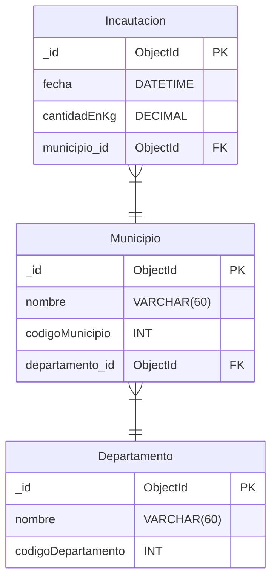

# Incautaciones Marihuana


### Crear la base de datos
```JavaScript
mongorestore --uri "mongodb+srv://<usuario>:<password>@<cluster>.mongodb.net" --db IncautacionesMarihuana './dump/'
```

### Diagrama Logico

